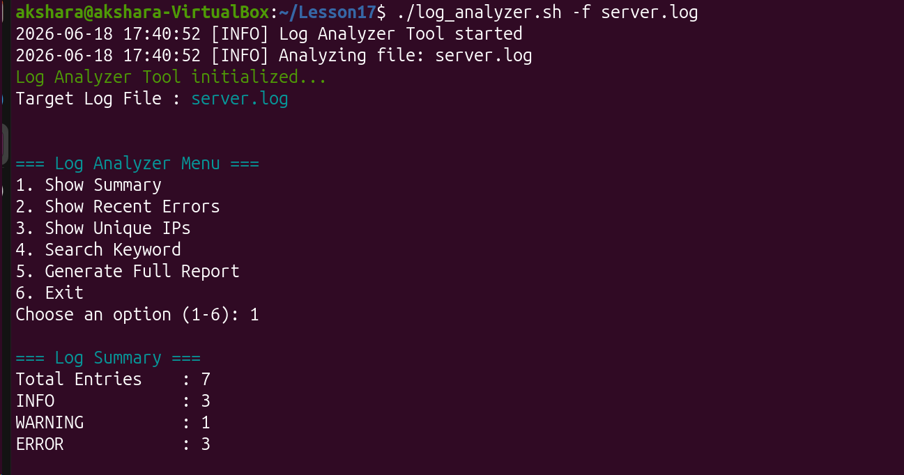
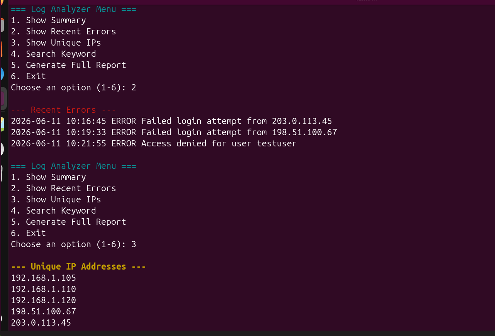
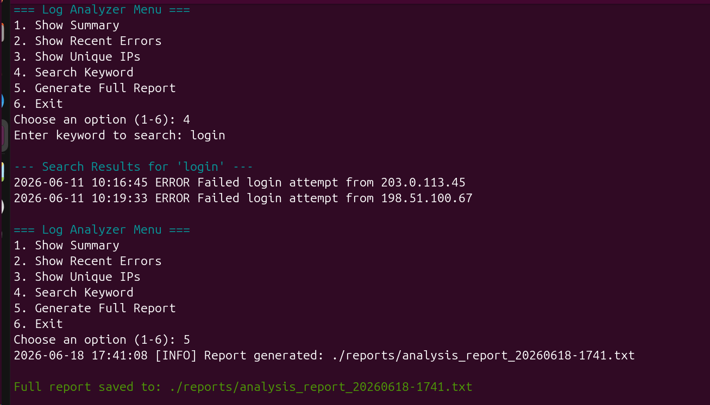
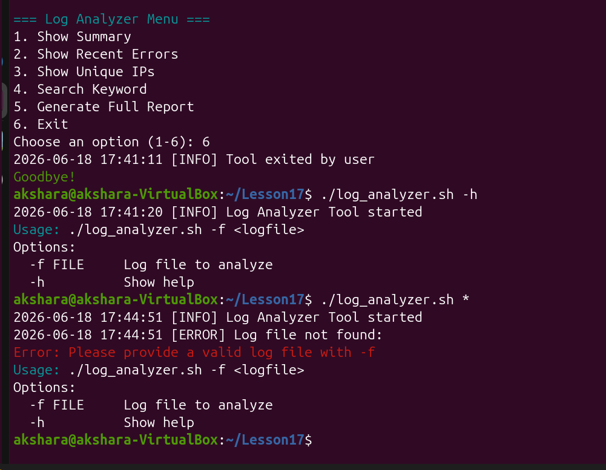

# Log Analyzer Tool

A professional Bash script for analyzing system and security logs with an interactive interface.






## Features

- Interactive menu-driven interface
- Log level summary (INFO, WARNING, ERROR counts)
- Recent error detection
- Unique IP address extraction
- Keyword search functionality
- Built-in logging system
- Colorful and user-friendly output
- Robust error handling

## How to Use

### Basic Usage
```bash
./log_analyzer.sh -f server.log

## How to Use 

# Prerequisites 
- Linux System 
- Basic terminal knowledge 

# Installation 
'''bash 
git clone https://github.com/yourusername/log-analyzer-tool.git
cd log-analyzer-tool
chmod u+x log_analyzer.sh 

## USAGE

# Basic Usage
./log_analyzer.sh -f filename 

# Show help 
./log_analyzer.sh -h 


## MENU OPTIONS 
1. Show Summary 
2. Show Recent Errors 
3. Show Unique IP Address
4. Search Keyword 
5. Generate Full Report 
6. Exit

## PROJECT STRUCTRE

.
├── log_analyzer.sh          # Main script
├── reports/                 # Generated analysis reports
├── logs/                    # Tool activity logs
├── server.log               # Sample log file (for testing)
├── screenshot-*.png         # Demo screenshots
└── README.md

# HOW IT WORKS 
-  This tool relies primarily on awk and grep for fast, dependency-free text processing.
-  Summary and report counts use awk pattern matching ERROR, INFO and WARNING keywords. 
-  IP extraction using regex pattern.
-  getopts for command line parsing.

## AUTHOR 
  Akshara | BCA Student 
